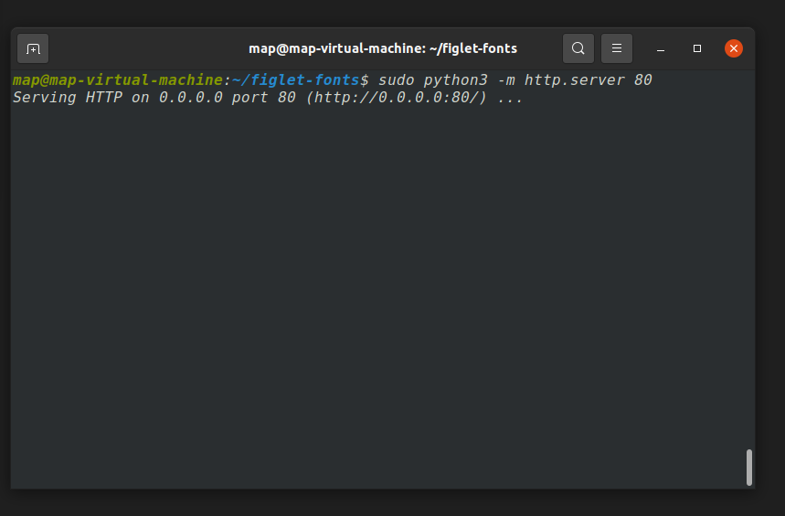
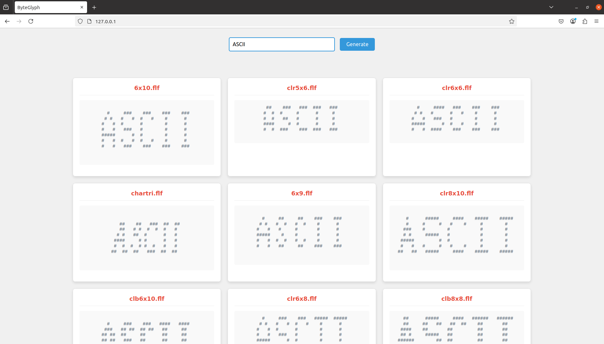
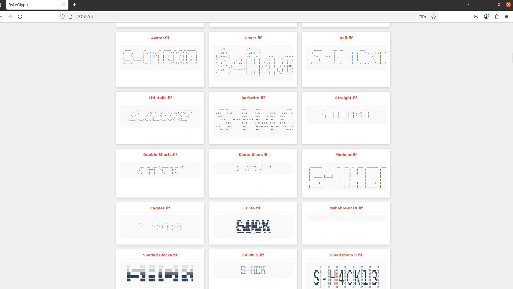
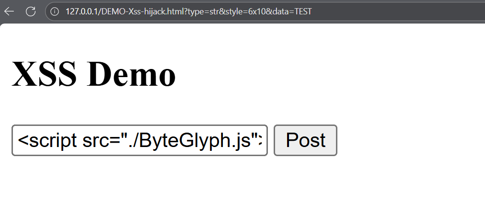
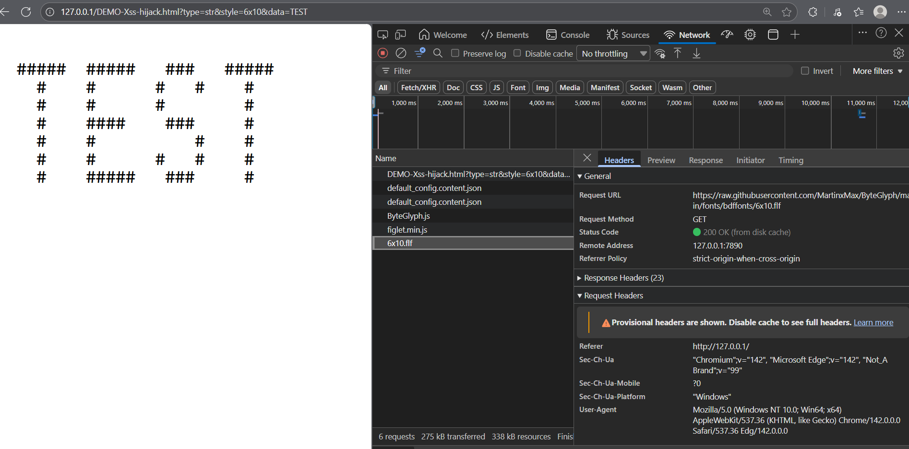

# ByteGlyph

Pure static HTML webpage for converting strings to ASCII art

[+] 755 character styles
[+] Pure static HTML
[+] LOGO generator


# Usage

`$ python3 -m http.server 80`



http://127.0.0.1






```
          @          @          @          @          @          @          @          @
          @          @          @          @          @          @          @          @
          @          @          @          @          @          @          @          @
  ▒████▒  @          @ ██    ██ @     ███  @   ▒████▒ @ ██   ███ @  ░███    @ ░▓████▒  @
 ▒██████  @          @ ██    ██ @    ▒███  @  ▓██████ @ ██  ▓██  @  ████    @ ███████▒ @
 ██▒  ▒█  @          @ ██    ██ @   ░████  @ ▒██▒  ░█ @ ██ ▒██▒  @  █▒██    @ █▒░  ▓██ @
 ██       @          @ ██    ██ @   ██░██  @ ██▓      @ ██░██▒   @    ██    @       ██ @
 ███▒     @          @ ██    ██ @  ▒█▒ ██  @ ██░      @ █████    @    ██    @      ▓██ @
 ▒█████▒  @          @ ████████ @ ░██  ██  @ ██       @ █████    @    ██    @   █████  @
  ░█████▒ @          @ ████████ @ ██   ██  @ ██       @ █████▒   @    ██    @   █████░ @
     ▒███ @  █████   @ ██    ██ @ ████████ @ ██░      @ ██▒▒██   @    ██    @      ▓██ @
       ██ @  █████   @ ██    ██ @ ████████ @ ██▓      @ ██  ██▓  @    ██    @       ██ @
 █▒░  ▒██ @          @ ██    ██ @      ██  @ ▒██▒  ░█ @ ██  ▒██  @    ██    @ █▒   ▓██ @
 ███████▒ @          @ ██    ██ @      ██  @  ▓██████ @ ██   ██▓ @ ████████ @ ███████▒ @
 ░█████▒  @          @ ██    ██ @      ██  @   ▒████▒ @ ██   ▒██ @ ████████ @ ▒█████▒  @
          @          @          @          @          @          @          @          @
          @          @          @          @          @          @          @          @
          @          @          @          @          @          @          @          @
```

# The Magician: Bend the XSS‑vulnerable server into your own art‑forging machine


Access the webpage with parameters.


`http://<server>/?type=str&style=6x10&data=TEST`


```
STYLE:
6x10
clr5x6
clr6x6
chartri
6x9
clr8x10
clb6x10
clr6x8
clb8x8
clr7x8
xchartri
tty
clb8x10
5x7
clr5x8
clr6x10
clr7x10
cli8x8
xchartr
5x8
ttyb
chartr
clr4x6
clr5x10
clr8x8
dosrebel
Obanner72
Obanner56
Obanner48
Obanner36
Obanner16
Obanner64
Obanner132
Obanner80
Obanner24
Pepper
Ticks Slant
Thin
Blocks
Big Money-ne
Small Isometric1
Line Blocks
Rotated
Knob
Larry 3D
Catwalk
JS Bracket Letters
Serifcap
Swamp Land
Train
Mike
Cosmike2
Jerusalem
Goofy
BlurVision ASCII
Tmplr
Rectangles
Rounded
Lockergnome
Slant Relief
Ogre
Relief2
Sweet
Computer
ANSI Regular
Crawford2
Big ASCII 9
ANSI Shadow
Reverse
Old Banner
Slant
Efti Wall
Red Phoenix
JS Block Letters
Bulbhead
Heart Left
Trek
Efti Water
Shimrod
Big ASCII 12
Pawp
Cursive
Octal
Dr Pepper
SL Script
Script
Linux
Avatar
Ghost
Bell
Efti Italic
Barbwire
Straight
Double Shorts
Konto Slant
Modular
Cygnet
Elite
Mshebrew210
Shaded Blocky
Calvin S
Small Mono 9
Ivrit
Wavy
Hieroglyphs
Moscow
Big Mono 12
S Blood
Gradient
Benjamin
Horizontal Right
Efti Chess
Cyberlarge
Flower Power
Babyface Leet
DOS Rebel
Arrows
Jacky
Decimal
Mono 12
Diet Cola
Alphabet
Wet Letter
Small Keyboard
Patorjk-HeX
Rammstein
Bright
Stop
Univers
AMC Neko
3D Diagonal
Contrast
Bloody
O8
Pyramid
Whimsy
Muzzle
Chunky
Pagga
Star Wars
Contessa
Runyc
AMC AAA01
Wavescape
ASCII New Roman
Mnemonic
Stampatello
3D-ASCII
Puzzle
Tombstone
Merlin2
Test1
Rot13
ICL-1900
AMC Tubes
Tiles
Small Shadow
B1FF
Mirror
Konto
Three Point
AMC Slider
1Row
Isometric2
OS2
Pebbles
Spliff
USA Flag
Term
Big Money-se
Filter
Tengwar
AMC Slash
LCD
Doom
Glenyn
Keyboard
Georgia11
Graffiti
Invita
Short
Wow
Runic
Tubular
Small ASCII 9
Braced
Terrace
Merlin1
Crazy
Twisted
Broadway KB
Tsalagi
Nancyj
Doh
Roman
Varsity
Stellar
3-D
Rowan Cap
Poison
Stick Letters
Alligator2
JS Capital Curves
Thick
Katakana
Small Poison
DiamFont
Georgi16
Small Block
Tanja
Gothic
Four Tops
Small Mono 12
ASCII 12
Electronic
Star Strips
ASCII 9
Thorned
Caligraphy
DWhistled
Banner4
JS Stick Letters
Banner3
Nancyj-Fancy
Banner
Dancing Font
NT Greek
Swan
Big Money-nw
Nancyj-Underlined
Diamond
Italic
Caligraphy2
Efti Robot
Bigfig
The Edge
Morse
Cola
Big Money-sw
JS Cursive
Isometric1
Isometric3
Fuzzy
AMC Untitled
Shadow
Cards
AMC Razor
miniwi
Double
Soft
Santa Clara
Fire Font-k
Puffy
Small ASCII 12
AMC Razor2
Hollywood
AMC 3 Line
Patorjk's Cheese
Basic
Colossal
Two Point
Tinker-Toy
NV Script
Peaks
Fraktur
Alpha
Big Chief
Big Mono 9
Morse2
Banner3-D
Graceful
Heart Right
Bolger
Larry 3D 2
RubiFont
Efti Font
Relief
Def Leppard
Slide
Greek
Impossible
Dot Matrix
Ghoulish
Mono 9
Nipples
Epic
Stronger Than All
Chiseled
Rozzo
Peaks Slant
Stacey
Cosmike
Fun Faces
Rebel
Cricket
Stforek
Flipped
NScript
Bubble
Coinstak
Speed
Fire Font-s
Babyface Lame
4Max
Efti Piti
DANC4
Maxfour
Acrobatic
Ticks
Kban
Madrid
Stampate
AMC 3 Liv1
Small Slant
Cybersmall
Fender
Letters
Fun Face
Jazmine
Alligator
Bear
Lean
Small Script
ANSI-Compact
3x5
5 Line Oblique
Sub-Zero
Big
Mini
Delta Corps Priest 1
Small Tengwar
Cybermedium
Henry 3D
Hex
THIS
Weird
AMC Thin
Small Caps
Isometric4
Block
Marquee
Small
Lil Devil
Horizontal Left
Crawford
Standard
Nancyj-Improved
Binary
Broadway
Digital
moscow
tengwar
smtengwar
morse
mshebrew210
tsalagi
ntgreek
jerusalem
katakana
runyc
runic
smpoison
hieroglyphs
amcslash
s-relief
4max
starstrips
doubleshorts
ghoulish
kontoslant
impossible
twisted
puzzle
tiles
heart_left
dosrebel
sweet
test1
stampate
jacky
smallcaps
georgi16
fire_font-k
morse2
bigfig
alpha
red_phoenix
greek
glenyn
oldbanner
heart_right
konto
bear
spliff
funface
rotated
tubular
henry3d
chiseled
fire_font-s
train
braced
dietcola
amcaaa01
peaksslant
funfaces
ICL-1900
amcun1
B1FF
merlin2
merlin1
cola
amcrazo2
Georgia11
ghost
swampland
soft
1row
muzzle
wetletter
horizontalleft
knob
filter
amc3liv1
wow
broadway_kb
rammstein
sub-zero
lineblocks
cards
benjamin
amc3line
bright
3d_diagonal
varsity
horizontalright
santaclara
blocks
bolger
alligator3
defleppard
arrows
modular
dancingfont
amcrazor
swan
flipped
DANC4
cygnet
wavy
keyboard
amctubes
shimrod
nancyj-improved
crazy
lildevil
stforek
amcthin
nscript
flowerpower
amcneko
reverse
amcslder
block
big
smshadow
banner
shadow
mini
slant
digital
lean
bubble
term
smslant
small
standard
script
smscript
ivrit
Obanner67
Obanner14
Obanner100
Obanner109
Obanner5
Obanner128
Obanner113
Obanner72
Obanner43
Obanner15
Obanner131
Obanner55
Obanner56
Obanner12
Obanner48
Obanner59
Obanner58
Obanner86
Obanner89
Obanner29
Obanner36
Obanner37
Obanner17
Obanner53
Obanner69
Obanner120
Obanner105
Obanner66
Obanner97
Obanner46
Obanner16
Obanner65
Obanner18
Obanner32
Obanner45
Obanner8
Obanner42
Obanner92
Obanner68
Obanner30
Obanner71
Obanner91
Obanner50
Obanner34
Obanner124
Obanner103
Obanner39
Obanner3
Obanner118
Obanner127
Obanner49
Obanner52
Obanner81
Obanner26
Obanner83
Obanner112
Obanner117
Obanner60
Obanner61
Obanner78
Obanner104
Obanner57
Obanner20
Obanner110
Obanner31
Obanner74
Obanner73
Obanner25
Obanner94
Obanner122
Obanner33
Obanner77
Obanner13
Obanner6
Obanner84
Obanner63
Obanner115
Obanner129
Obanner126
Obanner9
Obanner54
Obanner102
Obanner27
Obanner19
Obanner82
Obanner85
Obanner108
Obanner23
Obanner47
Obanner93
Obanner111
Obanner51
Obanner70
Obanner76
Obanner1
Obanner130
Obanner11
Obanner41
Obanner44
Obanner22
Obanner64
Obanner119
Obanner21
Obanner132
Obanner99
Obanner101
Obanner121
Obanner98
Obanner79
Obanner7
Obanner10
Obanner28
Obanner116
Obanner106
Obanner87
Obanner2
Obanner35
Obanner123
Obanner95
Obanner62
Obanner80
Obanner88
Obanner38
Obanner75
Obanner24
Obanner125
Obanner96
Obanner90
Obanner114
Obanner40
Obanner4
Obanner107
gb16st
hanglm16
gb16fs
cns
jiskan16
hanglg16
speed
calgphy2
alphabet
tinker-toy
broadway
italic
octal
alligator
doh
smkeyboard
dotmatrix
3-d
banner
straight
rowancap
stampatello
double
short
invita
stellar
coinstak
caligraphy
contessa
crawford
starwars
puffy
nancyj-underlined
barbwire
slide
rozzo
o8
hex
bell
ticks
banner4
eftirobot
eftipiti
nipples
isometric4
stacey
doom
mike
ogre
tsalagi
letters
gradient
tombstone
rot13
colossal
smisome1
isometric3
rounded
cybersmall
bigchief
binary
isometric2
eftifont
fraktur
alligator2
relief
linux
trek
rectangles
kban
eftiwater
whimsy
avatar
stop
banner3-D
threepoint
diamond
drpepper
lcd
twopoint
decimal
hollywood
pebbles
l4me
maxfour
rev
nvscript
cricket
larry3d
epic
pyramid
poison
pawp
5lineoblique
ticksslant
fuzzy
eftitalic
peaks
marquee
fender
univers
thin
mirror
usaflag
cosmike
banner3
madrid
katakana
thick
graceful
goofy
chunky
acrobatic
eftichess
eftiwall
relief2
cyberlarge
lockergnome
3x5
cosmic
runyc
sblood
pepper
slscript
fourtops
graffiti
cybermedium
bulbhead
tanja
jazmine
nancyj
contrast
catwalk
serifcap
isometric1
os2
nancyj-fancy
cursive
weird
basic
```


Exploit:

```js
<script src="./ByteGlyph.js"></script>
```
or

```
<script src="https://raw.githubusercontent.com/MartinxMax/ByteGlyph/refs/heads/main/ByteGlyph.js"></script>
```







 


